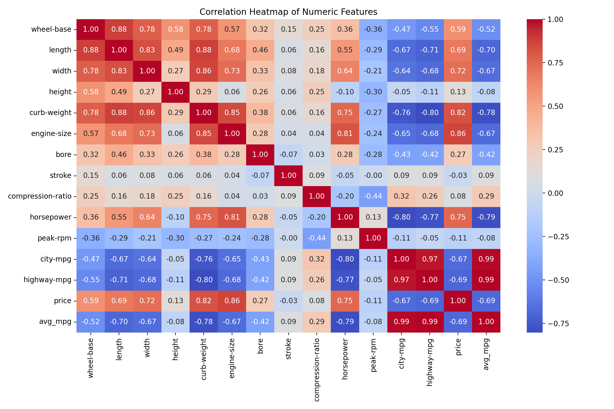
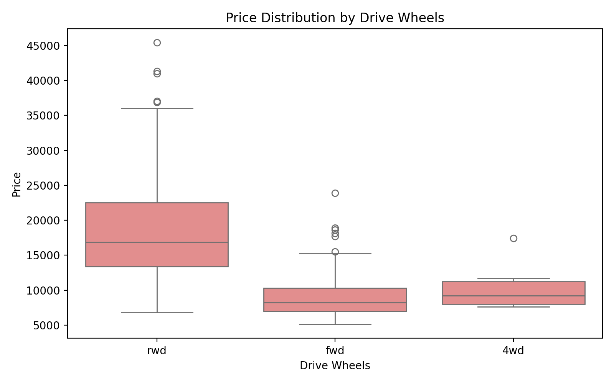
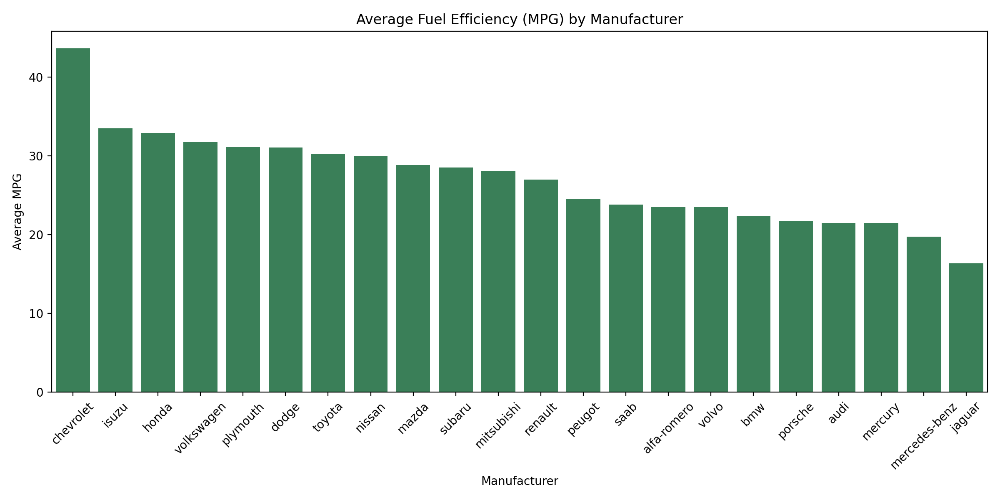

# Automobile Dataset Exploratory Data Analysis

Professional exploratory data analysis of the Automobile dataset using
Python and Jupyter. The notebook documents a full workflow from initial
data cleaning to focused insights and visual exploration.

## Project Overview

The analysis answers practical questions about vehicle attributes, pricing,
fuel efficiency, and manufacturer trends. It uses structured steps to
prepare the dataset, validate data quality, and explore relationships among
numerical and categorical features.

## Objectives

- Clean and sanitize the dataset for analysis.
- Inspect and validate data quality (duplicates, missing values, types).
- Identify and visualize key relationships between features.
- Compare groups such as body style, fuel type, and drive wheels.
- Summarize insights on pricing, fuel efficiency, and engine size.

## Data Source

- `automobile.txt` is the raw dataset used in the notebook.

## Analysis Highlights

The notebook includes:

- Column removal to focus analysis on relevant features.
- Duplicate checks and removal (with before/after validation).
- Missing value checks and type conversions for numeric columns.
- Correlation heatmap for numeric relationships.
- Scatter plots for price vs engine size and horsepower.
- Box plots for price distribution by category.
- Distribution of body styles using a pie chart.
- Top 5 most expensive and cheapest vehicles with mpg comparison.
- Average fuel efficiency by manufacturer with ranked results.
- Largest engine capacity vehicles and summary insights.
- Manufacturer with the most models in the dataset.

## Key Findings

- Price shows strong positive relationships with engine size and horsepower.
- Drive wheels and body style categories show clear price differences.
- Fuel-efficient manufacturers tend to cluster in lower price ranges.
- Luxury brands dominate the largest engine capacity vehicles.

## Outputs

The notebook produces:

- Cleaned dataframe ready for exploration.
- Summary tables for top/bottom comparisons.
- Visualizations for patterns and distributions.
- Text-based findings to support key conclusions.

## Figures

Run the export cell in the notebook to generate the images below.

## Reproducibility

- Python: 3.x
- Run the notebook from top to bottom to reproduce the analysis.
- Ensure `automobile.txt` is in the project root.

## Optional Enhancements

- Add advanced visualizations such as a pairplot with `hue='drive-wheels'`.
- Use a violin plot to compare `price` distributions across `make`.
- Export selected figures to an `images/` folder and embed them here.
- Add a brief modeling section (e.g., price prediction baseline).

## Requirements

Install dependencies:

`pip install -r requirements.txt`

## Usage

1. Ensure `automobile.txt` is in the project root.
2. Start Jupyter:

`jupyter notebook automobiles.ipynb`

3. Run all cells to reproduce the analysis and plots.

## Project Structure

- `automobiles.ipynb` Notebook with full analysis.
- `automobile.txt` Source dataset.
- `README.md` Project documentation.
- `requirements.txt` Python dependencies.
